# Isometric tiles in Blender for Unity

This is an attempting to standardize mine procedure of creating 2D isometric tilesets in Blender (2.8x).
This was based at the [Clint ballanger's](http://clintbellanger.net/articles/isometric_tiles/) and [GameFromScratch](https://www.gamefromscratch.com/post/2015/11/20/Creating-Isometric-Tiles-in-Blender.aspx) tutorials.

The basic [.blend](resources/BaseIsometricTilesets.blend) file (made with Blender 2.81) and the reference images ([512px](resources/CubeTileBase_512.png), [768px](resources/CubeTileBase_768.png), [1024px](resources/CubeTileBase_1024.png)) can be found at the [resources](resources/) folder.

<!-- ______________
 **`Attention:`**

`The result rendered images of the cubes will always have 1024px. So, the desired ones with 512px and 768px, will need to be manually cut on an image editor to proper work on Unity.`
______________ -->

## **Blender setup**

### **Eevee**

| **Description**                                                                                                                                               |                                    **Image reference** |
| ------------------------------------------------------------------------------------------------------------------------------------------------------------- | -----------------------------------------------------: |
| On the render properties tab, on Film dropdown, enable Transparent option. Also, on Color Management dropdown, set Medium Contrast at Look option as follows: | 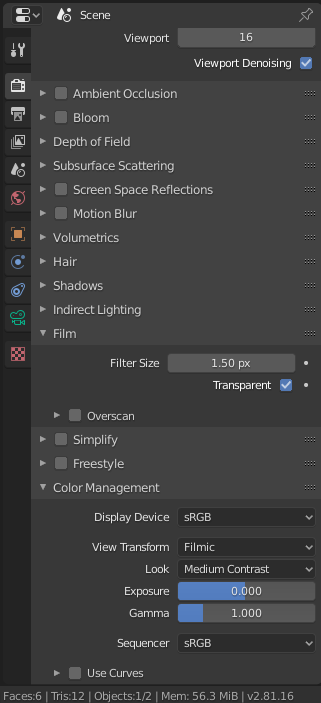 |

### Cameras

#### **Change between cameras**

| **Description**                                                                                                                                                                |                                        **Image reference** |
| ------------------------------------------------------------------------------------------------------------------------------------------------------------------------------ | ---------------------------------------------------------: |
| Use the "CamForPlanes" camera to render planes, and the "CamForCubes" to render cube like tiles. Is possible to change between cameras on the Scene Properties tab as follows: | 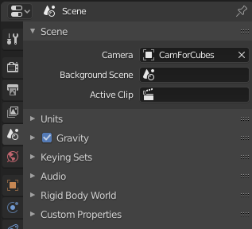 |

#### **Camera for Planes**

______________
 **`Attention:`**

`I'm not using this camera anymore. All the renders will be done with` [CamForCubes](#Camera-for-Cubes) `camera. See` [Unity setup](#Unity-setup) `for more information about the correct positioning of the tiles on Unity.`
______________

| **Location**    |                                                           **Rotation** |
| --------------- | ---------------------------------------------------------------------: |
| X: 10           |                                                                 X: 60º |
| Y: -10          |                                                                  Y: 0º |
| Z: 8.17         |                                                                 Z: 45º |
| Image reference | 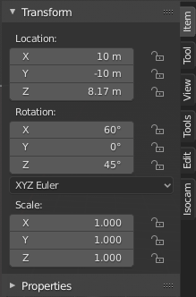 |

**Lens**

| **Property**       |                                                  **Value** |
| ------------------ | ---------------------------------------------------------: |
| Type               |                                               Orthographic |
| Orthographic Scale |                                                      2.800 |
| Image reference    | 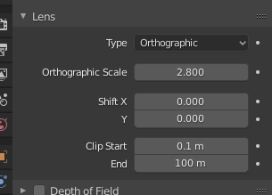 |

**Render Size**

| **Description**                                                                                                                |                                                 **Image reference** |
| ------------------------------------------------------------------------------------------------------------------------------ | ------------------------------------------------------------------: |
| For rendering with the "CamForPlanes" camera, the output resolution need to be **_X: 512 px_** and **_Y: 256 px_** as follows: | 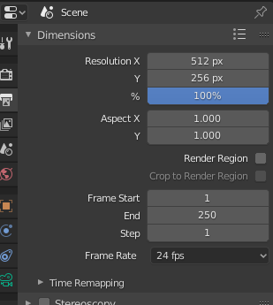 |

#### **Camera for Cubes**

______________
 **`Attention:`**

`After some more test, I decided to render everything with the "CamForCubes" camera. Then, after import the tiles to Unity, I can adjust the Pivot of each sprite. This way I can avoid manually cut the rendered images on an image editor... See` [Unity setup](#Unity-setup) `for more information about the correct positioning of the tiles on Unity.`
______________

| **Location**    |                                                         **Rotation** |
| --------------- | -------------------------------------------------------------------: |
| X: 10           |                                                               X: 60º |
| Y: -10          |                                                                Y: 0º |
| Z: 9.6          |                                                               Z: 45º |
| Image reference | 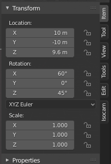 |

**Lens**

| **Property**       |                                                    **Value** |
| ------------------ | -----------------------------------------------------------: |
| Type               |                                                 Orthographic |
| Orthographic Scale |                                                        5.600 |
| Image reference    | 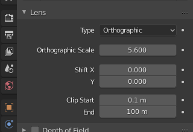 |

**Render Size**

| **Description**                                                                                                                |                                                **Image reference** |
| ------------------------------------------------------------------------------------------------------------------------------ | -----------------------------------------------------------------: |
| For rendering with the "CamForCubes" camera, the output resolution need to be **_X: 512 px_** and **_Y: 1024 px_** as follows: | 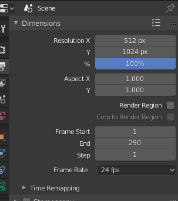 |

______________
 **`Attention:`**

`I did use background images on the "CamForCubes" camera to set the correct size of each cube.`
______________

### Cubes

All the cubelike tiles will be rendered with the "CamForCubes" camera, with a resolution of 512x1024px. The cubes (Tile_512, Tile_768 and Tile_1024) of the "BaseTiles" collection on the Blender file and the background images of the "CamForCubes" camera are used as visual references. See [Unity setup](#Unity-setup) for more information about the correct positioning of the tiles on Unity.

#### **Standard Cube for Tile 512px**

**Scale:**

| **Axis** | **Value** |
| -------- | --------: |
| X        |      1.98 |
| Y        |      1.98 |
| Z        |      1.61 |

| **Description**                                                                                                                |                                              **Image reference** |
| ------------------------------------------------------------------------------------------------------------------------------ | ---------------------------------------------------------------: |
| Used "CubeTileBase_512.png" as background image of the "CamForCubes" camera, with _**Offset Y**_ of _**-0.25000**_ as follows: | 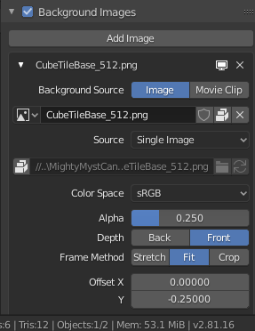 |

#### **Standard Cube for Tile 768px**

**Scale:**

| **Axis** | **Value** |
| -------- | --------: |
| X        |      1.98 |
| Y        |      1.98 |
| Z        |      3.23 |

| **Description**                                                                                                                |                                              **Image reference** |
| ------------------------------------------------------------------------------------------------------------------------------ | ---------------------------------------------------------------: |
| Used "CubeTileBase_768.png" as background image of the "CamForCubes" camera, with _**Offset Y**_ of _**-0.12500**_ as follows: | 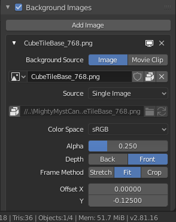 |

#### **Standard Cube for Tile 1024px**

**Scale:**

| **Axis** | **Value** |
| -------- | --------: |
| X        |      1.98 |
| Y        |      1.98 |
| Z        |      4.84 |

| **Description**                                                                                                                |                                                **Image reference** |
| ------------------------------------------------------------------------------------------------------------------------------ | -----------------------------------------------------------------: |
| Used "CubeTileBase_1024.png" as background image of the "CamForCubes" camera, with _**Offset Y**_ of _**0.00000**_ as follows: |  |

## **Unity setup**

After had some tiles, is time to create a new 2D Unity project and bring yours tiles inside it.
The setup of the tilemap is very simple.

| **Description**                                                                                                                                                                                                                                     |                                                         **Image reference** |
| --------------------------------------------------------------------------------------------------------------------------------------------------------------------------------------------------------------------------------------------------- | --------------------------------------------------------------------------: |
| As all cubelike tiles will be rendered at 512x1024px, you'll need to customize its Pivot after importing the sprites. On the Inspector panel, set (for each sprites) its **Pivot** to **_Custom_** with **_X: 0.5_** and **_Y: 0.277_** as follows: |        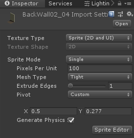 |
| On the Hierarchy panel, right click and pick Tilemap as follows:                                                                                                                                                                                    |            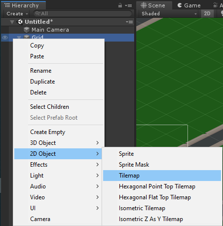 |
| Select the Grid GameObject on the Hierarchy panel. And, on the Inspector panel -> Grid component tab, set the Cell Size X: 5.1 and Y: 2.55. Also, set Cell Layout to Isometric as follows:                                                          |            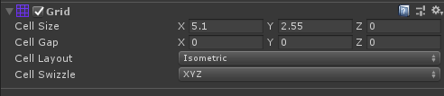 |
| Optional: Select the Tilemap GameObject (the child of the Grid GameObject) on the Hierarchy panel. And, on the Inspector panel -> Tilemap Renderer component tab, set the Mode to Individual as follows:                                            | 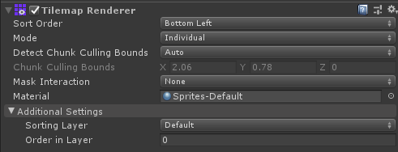 |
| Optional: On the menu Edit -> Project Settings, go to the Graphics options an set the Transparency Sort Axis to X: 0, Y: 1 and Z: 0, as follows:                                                                                                    |  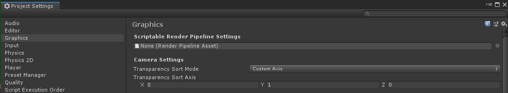 |
| Open the Tile Palette panel via menu Window -> 2D -> Tile Palette. Then, on the Tile Palette panel, create a new palette giving it a name, set Grid to Isometric and Cell Size to Automatic, as follows:                                            |              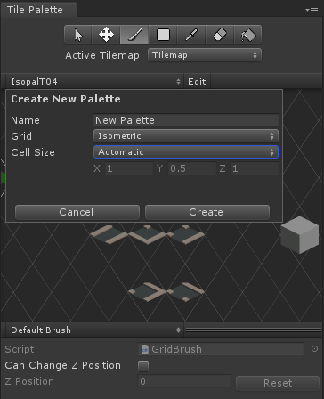 |
| Drag and drop yours sprites (the tiles made on Blender) inside the Tile Palette panel grid.                                                                                                                                                         |                                                                             |
| Start creating your map.                                                                                                                                                                                                                            |                                                                             |

**Have fun!!**
